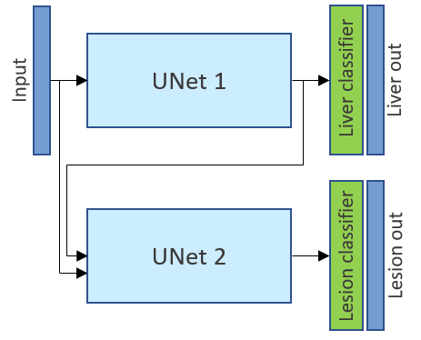

# Liver_Lesion_Segmentation

The goal of this project is to segment liver from CT scans and to detect unhealthy tissues. 

This network is trained end-to-end and outputs two images: a segmentation mask for the liver and for the lesion.

  

